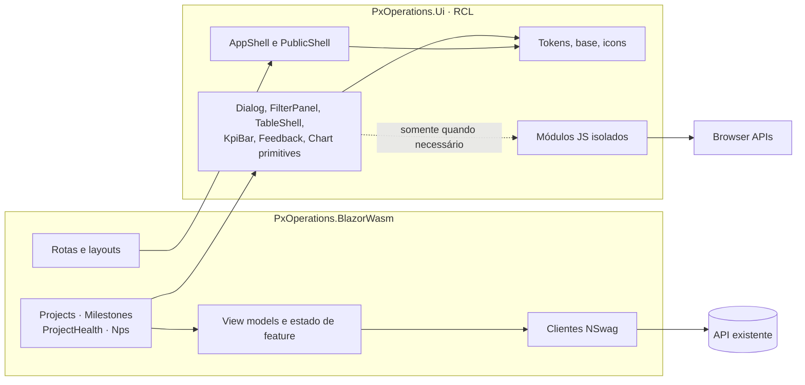

# RFC: Arquitetura do redesign de front-end

- **Versão:** 2.0
- **Tipo:** Design doc de engenharia
- **Status:** Proposto para aprovação
- **Autor(es):** Matheus Donangelo
- **Audiência:** Engenharia, Design, Produto, CTO
- **Responsável pela decisão:** CTO
- **Última atualização:** 2026-07-24
- **Relacionados:** [PRD da plataforma](PRD.md) ·
  [PRD do NPS](../nps/PRD.md) · [Fluxos e backend do NPS](../nps/FLUXOS.md)

> **Decisão solicitada.** Aprovar a RCL `PxOperations.Ui`, os limites entre design system e
> features, a estratégia híbrida de CSS, o uso de módulos JavaScript mínimos para APIs do
> navegador, o `<dialog>` nativo e a migração incremental descritos nesta RFC.
>
> **Linguagem normativa.** “Deve” e “não deve” indicam requisito. Uma exceção exige justificativa
> no PR e, quando altera uma decisão estrutural, revisão desta RFC.
>
> **Precedência.** Esta RFC governa o frontend compartilhado. `design/nps/FLUXOS.md` continua
> sendo a fonte para o backend atual e para as mudanças N1. Em padrões transversais, esta RFC
> resolve as pendências antigas de URL e idioma: parâmetros repetidos e preservação de espanhol.

## 1. Resumo e decisão

O cliente continuará sendo uma aplicação Blazor WebAssembly com estado de produto em C#. O
redesign será implementado por uma Razor Class Library (RCL) chamada `PxOperations.Ui`, usada
pelo cliente por `ProjectReference`. A RCL conterá tokens, assets próprios e componentes de
apresentação reutilizáveis; rotas, chamadas de API, regras de feature e composição de página
continuarão no `PxOperations.BlazorWasm`.

A decisão combina cinco mecanismos:

1. **CSS global pequeno** para reset, tokens semânticos e elementos base.
2. **CSS isolation** (`.razor.css`) para componentes da RCL e composições de página.
3. **Cascade layers** para manter o CSS legado abaixo da nova fundação durante a migração.
4. **Estado em Blazor** para navegação, filtros, tabelas, formulários, gráficos e feedback.
5. **JavaScript isolado e mínimo** somente para APIs do navegador: tema antes do boot,
   `<dialog>`, clipboard, idioma do documento e preferência do sistema.

O HTML/CSS/JS em `design/nps/` é referência de experiência, não código para copiar integralmente.
O CSS será normalizado para o novo escopo; `brq-ui.js` e `brq-charts.js` não entram na aplicação.

### 1.1 Decisões que corrigem o rascunho anterior

- A migração **não** depende apenas da ordem dos `<link>`: há colisões reais entre seletores
  atuais e os protótipos (`.btn`, `.toolbar`, `.stat`, `.table-wrap`, `.empty`).
- O script anti-flash de tema **não** será inline. A CSP atual permite script próprio, mas
  bloqueia inline; o inicializador será um arquivo síncrono same-origin.
- Modal novo usa `<dialog>.showModal()`. O pequeno interop necessário é preferível a reimplementar
  top layer, inércia, foco e Escape com uma `div`.
- Não haverá `DataTable<T>` ou motor de gráficos universal na Fase 0. Tabela e gráfico serão
  componentes composicionais, extraídos conforme os usos reais.
- “Frontend-only” vale para F1–F3 e N0. O NPS alvo N1 mantém as dependências de backend
  explicitadas no PRD específico.
- A ausência atual de autenticação/autorização é tratada como fato; o redesign não cria segurança
  por ocultação de controles.

## 2. Baseline, escopo e invariantes

### 2.1 Evidência do repositório

| Área | Estado atual | Implicação |
|---|---|---|
| **Estilo** | `wwwroot/css/app.css` tem 1312 linhas e classes globais | Convivência precisa de escopo e precedência controlados |
| **Fontes** | `index.html` carrega Inter e Space Mono do Google Fonts | Produção faz requisições a terceiros e a CSP contém exceções externas |
| **Bootstrap** | `wwwroot/lib/bootstrap/` existe, mas não é referenciado em runtime | Pode ser removido após busca estática e validação do publish; não reduz bytes hoje |
| **Shell** | `MainLayout` + `NavMenu` implementam topbar horizontal | F0 troca o shell sem trocar as rotas |
| **Componentes** | A maior parte da UI vive em `Features/*` | A RCL deve receber apenas padrões compartilhados, não regras das features |
| **Modais** | Overlays são `div` controladas por estado Blazor | A migração precisa preservar callbacks e adotar semântica nativa |
| **JavaScript** | Uso reduzido, principalmente clipboard no NPS | Não há motivo para portar o runtime JavaScript dos mockups |
| **API** | Clientes NSwag são gerados do OpenAPI e registrados no cliente | Componentes da RCL não devem conhecer esses DTOs |
| **Segurança** | CSP: `script-src 'self' 'wasm-unsafe-eval'`, sem `unsafe-inline` para script | Inicialização inline de tema quebraria em produção |
| **Referrer/telemetria** | A rota pública contém token e a policy atual envia a URL completa em requests same-origin | Token pode alcançar headers ou atributos de observabilidade sem redação |
| **Cache** | nginx marca `/css/*` como `immutable` por 1 ano, mas `app.css` tem URL estável sem hash | Um deploy pode continuar usando CSS antigo |
| **Acesso** | Não há autenticação/autorização implementada | UI não deve inventar perfis ou alegar proteção |
| **Projetos** | “Exportar CSV” é um botão sem handler | Não é paridade funcional; exige decisão de produto |
| **NPS** | Protótipo e contrato v1 divergem em capacidades centrais | N0 e N1 precisam permanecer entregas distintas |

O baseline funcional definitivo será a matriz F0a do PRD: rota, estado, ação, origem do dado e
teste correspondente. A leitura de código acima orienta a arquitetura, mas não substitui a
validação com Produto.

### 2.2 Dentro desta RFC

- Criar `src/Client/PxOperations.Ui`.
- Adicionar o projeto à solution com referência apenas do cliente.
- Implementar tokens, shells, tema, componentes essenciais e interop isolado.
- Criar testes próprios da RCL e ampliar os testes do cliente.
- Migrar F1 Projetos, F2 Saúde, F3 Marcos e N0 NPS v1 incrementalmente.
- Remover CSS e assets legados à medida que deixam de ter consumidores.
- Adicionar o harness de navegador, acessibilidade e regressão visual necessário aos gates.

### 2.3 Fora desta RFC

- Alterações de Domain, Application, Infrastructure ou API para F1–F3.
- Desenho detalhado das capacidades de backend N1; elas seguem o PRD/FLUXOS de NPS e exigem
  design técnico próprio.
- Autenticação, autorização, perfis e administração de acesso.
- Um pacote NuGet público ou suporte a múltiplos produtos antes de existir consumidor.
- Biblioteca de gráficos, grid de dados ou framework de formulários de propósito geral.

### 2.4 Invariantes arquiteturais

- `PxOperations.Ui` não referencia nenhum projeto de servidor nem o cliente gerado.
- `PxOperations.BlazorWasm` continua sem referência a projetos de servidor.
- DTOs NSwag são adaptados para view models dentro da feature, nunca expostos na API pública da
  RCL.
- Regra de domínio não é recalculada em componente visual.
- Scripts, fontes e ícones de produção são same-origin.
- Não se adiciona manipulação arbitrária do DOM fora de módulos pequenos e documentados.
- A aplicação continua funcional página a página durante a transição.
- F0a registra a matriz corporativa de navegadores. Até ela existir, o alvo são as versões
  estáveis correntes de Chrome, Edge, Firefox e Safari; não será adicionado polyfill para
  Internet Explorer. Uma política corporativa diferente reabre esta decisão.

### 2.5 Quando esta RFC deve ser reaberta

- Uma feature F1–F3 precisa mudar o OpenAPI.
- A RCL passa a depender de DTO, serviço ou projeto do servidor.
- Surge proposta de script global, framework CSS, grid ou chart library.
- Um componente precisa manipular DOM fora de seu próprio elemento.
- A política de navegadores inviabiliza `<dialog>`, CSS isolation ou cascade layers.
- N1 for incorporado ao mesmo rollout sem seu plano de compatibilidade.

## 3. Arquitetura e limites de responsabilidade



### 3.1 Estrutura proposta

```text
src/Client/
  PxOperations.Ui/
    Components/
      Foundations/
      Feedback/
      Navigation/
      Overlays/
      DataDisplay/
      Forms/
    Theming/
    wwwroot/
      css/
      fonts/
      icons/
      js/
    PxOperations.Ui.csproj

  PxOperations.BlazorWasm/
    Features/
      Projects/
      Milestones/
      ProjectHealth/
      Nps/
    Layout/
    wwwroot/
      css/
        legacy.css

tests/Client/
  PxOperations.Ui.Tests/
  PxOperations.BlazorWasm.Tests/
  PxOperations.E2ETests/
```

O nome/pacote da RCL deve permanecer `PxOperations.Ui`, porque ele participa das URLs estáveis
de static web assets (`_content/PxOperations.Ui/...`). Inicialmente a distribuição é por
`ProjectReference`; não há publicação em feed NuGet.

Um guard arquitetural automatizado deve falhar se a RCL passar a referenciar projeto de servidor,
assembly do cliente gerado ou namespace de feature. O teste pode viver em `PxOperations.Ui.Tests`
ou em um teste arquitetural dedicado, desde que rode em `dotnet test PX-Operations.sln`.

### 3.2 O que pertence à RCL

- Tokens e estilos base.
- Ícones próprios com uma API acessível.
- Shell interno e shell público sem conhecimento de rotas específicas; itens são parâmetros.
- Primitivas com semântica estável: botão, chip, tag, pill, estado vazio, feedback e diálogo.
- Padrões composicionais: cabeçalho, faixa de KPI, painel de filtro e invólucro de tabela.
- Serviços de tema e adapters de APIs do navegador.
- Tipos de UI pequenos e neutros, como `ThemePreference` e `SortDirection`.

### 3.3 O que permanece na feature

- `@page`, autorização futura, query string e navegação de produto.
- Chamadas aos clientes gerados, cancellation e tratamento de erro da API.
- View models, mapeamento de enum, formatação específica e vocabulário de domínio.
- Predicados de filtro, ordenação, agrupamento e seleção.
- Regras de habilitação de ação.
- Formulários e validação ligados ao contrato da feature.
- Composição de tabela, card, calendário, Kanban ou gráfico específico.

Um componente RCL recebe valores, `RenderFragment`, callbacks e tipos neutros. Se sua assinatura
contém `ProjectView`, `NpsDispatchView` ou outro DTO gerado, o limite foi violado.

### 3.4 Regra de promoção

Shell, tema, foco e feedback são transversais por natureza e nascem na RCL. Uma composição de
feature só é promovida quando:

1. há pelo menos dois usos reais com a mesma semântica;
2. a API não contém flags condicionais por módulo;
3. o nome continua compreensível fora da feature de origem;
4. testes cobrem o contrato compartilhado;
5. a promoção reduz código sem esconder regra de negócio.

Duplicação pequena e temporária é preferível a uma abstração que precise conhecer todas as
features.

### 3.5 Catálogo inicial, não contrato infinito

| Componente | Responsabilidade | Não faz |
|---|---|---|
| `BrqAppShell` | Sidebar, header móvel, skip link e região principal | Não conhece clientes ou permissões |
| `BrqPublicShell` | Identidade e conteúdo público focado | Não renderiza navegação interna |
| `BrqThemeToggle` | Escolha e anúncio do tema | Não acessa `localStorage` diretamente |
| `BrqPageHeader` | Título, descrição e slot de ações | Não decide ações da feature |
| `BrqKpiBar` | Layout e semântica dos indicadores | Não calcula métricas |
| `BrqFilterPanel` | Disclosure, grupos, chips e eventos | Não filtra coleções nem usa `role="menu"` |
| `BrqTableShell` | Caption, scroll controlado e slots semânticos | Não busca, pagina ou ordena DTOs |
| `BrqDialog` | Ciclo modal, foco e callbacks | Não mantém estado de domínio |
| `BrqEmptyState` | Estado vazio com ação opcional | Não confunde vazio com erro |
| `BrqToastRegion` | Anúncios transitórios enfileirados | Não substitui erro junto ao campo |
| `BrqStatusPill` | Texto + forma/ícone + cor | Não interpreta enum de domínio |
| `BrqChartFrame` | Título, resumo, legenda e alternativa tabular | Não é um motor genérico de charts |

O catálogo cresce por necessidade observada. `DataTable<T>` e `BrqChart(config)` não fazem parte
da Fase 0.

## 4. CSS, tokens e assets

### 4.1 Estratégia de ownership

| Tipo de estilo | Local | Escopo |
|---|---|---|
| Reset, tokens, elementos base, print | RCL `wwwroot/css/foundation.css` | Global e intencional |
| Componente reutilizável | `Component.razor.css` na RCL | CSS isolation |
| Composição de página | `Page.razor.css` no app | CSS isolation |
| Legado ainda necessário | `wwwroot/css/legacy.css` | Global, dentro de `@layer legacy` |
| Utilitário excepcional | RCL, prefixo `.brq-u-*` | Global, pequeno e documentado |

O CSS isolado é compilado pelo Blazor, recebe atributo de escopo e é agregado ao
`PxOperations.BlazorWasm.styles.css`; estilos isolados da RCL são importados automaticamente
pelo bundle do app. Não se adicionam `<link>` individuais para cada `.razor.css`.

### 4.2 Cascade layers durante a transição

`foundation.css` declara a ordem antes de qualquer regra:

```css
@layer reset, legacy, tokens, base, utilities;

@layer reset {
  /* normalização mínima */
}

@layer tokens {
  /* custom properties semânticas */
}

@layer base {
  /* html, body, tipografia, links, controles nativos */
}

@layer utilities {
  /* somente .brq-u-* */
}
```

`legacy.css` envolve todo o CSS antigo:

```css
@layer legacy {
  /* conteúdo temporário do antigo app.css */
}
```

O `index.html` carrega:

```html
<link rel="stylesheet" href="_content/PxOperations.Ui/css/foundation.css" />
<link rel="stylesheet" href="css/legacy.css" />
<link rel="stylesheet" href="PxOperations.BlazorWasm.styles.css" />
```

Para declarações normais, `tokens`, `base` e `utilities` vencem `legacy` pela ordem das camadas,
independentemente da ordem física dos dois primeiros arquivos. O bundle isolado fica
deliberadamente sem camada e vem por último: ele tem precedência sobre a fundação, mas seus
seletores não vazam para outros componentes.

Regras obrigatórias:

- todo seletor global novo usa `brq-` ou é um elemento base deliberado;
- nenhum arquivo novo reutiliza `.btn`, `.toolbar`, `.stat`, `.table-wrap` ou `.empty`;
- `!important` exige comentário com a limitação que resolve;
- F0b confirma que `legacy.css` não contém `!important`; em cascade layers, declarações
  importantes têm ordem invertida e não podem ser usadas para furar a estratégia;
- páginas não usam `::deep` para estilizar a implementação interna de um componente da RCL;
- customização ocorre por parâmetro, slot ou custom property pública;
- layout novo prefere propriedades lógicas (`margin-inline`, `padding-block`, `inline-size`);
- uma seção legada é removida no mesmo PR que migra seu último consumidor.

### 4.3 Tokens

Páginas consomem apenas tokens semânticos, por exemplo:

```css
--brq-color-canvas
--brq-color-surface
--brq-color-text
--brq-color-text-muted
--brq-color-border
--brq-color-accent
--brq-color-danger
--brq-color-focus
--brq-space-1
--brq-radius-md
--brq-shadow-overlay
--brq-duration-fast
```

Paleta primitiva e valores de marca ficam encapsulados em `tokens`; uma página não usa um hex
diretamente. Tokens de estado precisam manter significado em claro, escuro e
`forced-colors`. `color-scheme` é declarado no elemento raiz para que controles nativos
acompanhem o tema.

### 4.4 Fontes, ícones e imagens

- Produção não carrega Google Fonts ou outro host de assets.
- A pilha inicial é `system-ui` e `ui-monospace`.
- Aspekta, Inter ou Geist só entram se licença, origem e arquivos WOFF2 estiverem registrados.
- Fonte própria usa subset necessário, WOFF2, `font-display: swap` e métricas de fallback
  (`size-adjust`/overrides, quando aplicáveis) para evitar layout shift.
- Ícones são SVG próprios, herdam `currentColor` e recebem nome acessível somente quando
  transmitem informação; ícone decorativo usa `aria-hidden="true"`.
- SVG de conteúdo tem alternativa textual. SVG não é usado para texto comum.

Os arquivos de `design/nps/assets/` são matéria-prima. Antes de entrar na RCL, cada asset passa
por revisão de licença, namespace, contraste e remoção de dependência do DOM do protótipo.

### 4.5 Bootstrap

`wwwroot/lib/bootstrap/` é removido em F0b depois de:

1. busca estática sem referência fora da própria pasta;
2. build/publish sem asset solicitado;
3. smoke test das rotas.

A remoção reduz repositório e artefato publicado; não será reportada como economia de bytes de
runtime porque o Bootstrap não é carregado hoje.

### 4.6 Cache e fingerprint

Cache imutável só é seguro quando a URL muda com o conteúdo. F0b corrige
`Hosting/nginx.conf.template` com estas regras:

- `index.html` e o fallback da SPA usam `no-store`;
- assets realmente fingerprinted/content-addressed usam
  `public, max-age=31536000, immutable`;
- CSS, JS, fonte ou imagem com nome estável usa revalidação (`no-cache, must-revalidate`) e
  `ETag`/`Last-Modified`, nunca `immutable`;
- nenhuma pasta inteira recebe cache imutável apenas por se chamar `css`, `images` ou `_content`;
- a saída publicada, e não o caminho no source, determina se uma URL contém fingerprint.

O projeto já habilita `OverrideHtmlAssetPlaceholders`. F0b deve preferir o fingerprinting do
pipeline .NET 10 para assets próprios quando ele produzir URL resolvível sob a CSP atual. Se um
asset não puder ser fingerprinted com segurança, revalidação é o fallback correto. Um teste de
headers no artefato publicado cobre `index.html`, framework, CSS isolado, foundation, módulo JS,
fonte e imagem.

## 5. Tema e shells

### 5.1 Resolução de tema sem flash e compatível com CSP

A precedência é:

1. valor válido `light` ou `dark` em `localStorage["px-theme"]`;
2. `prefers-color-scheme`;
3. `light` como fallback.

Um arquivo pequeno, síncrono, sem dependências e same-origin é executado no `<head>` antes das
folhas de estilo:

```html
<script src="_content/PxOperations.Ui/js/theme-init.js"></script>
```

Ele valida o valor, resolve o fallback e define `data-theme` no `<html>`; o CSS deriva
`color-scheme` desse atributo. Falha de `localStorage` é capturada sem impedir o boot. Não se
adiciona `unsafe-inline`, nonce manual ou `eval`.

Depois do boot, `ThemeService` é o único dono da preferência. O serviço importa um módulo ES,
grava a escolha, observa mudança de `prefers-color-scheme` quando não há escolha explícita e
notifica componentes. Referências `IJSObjectReference`, listeners e `DotNetObjectReference`
são descartados em `DisposeAsync`.

### 5.2 Shell interno

`BrqAppShell` oferece:

- link “Pular para o conteúdo”;
- sidebar desktop;
- drawer móvel sobre a mesma fundação nativa de diálogo, com gatilho nomeado, Escape e retorno
  de foco;
- item ativo via `aria-current="page"`;
- landmark `nav` nomeado e um único `main`;
- slot de conteúdo e região de feedback;
- layout que não encobre o elemento focado.

Os itens de navegação são fornecidos pelo app como dados. O shell não consulta rota, API ou
perfil sozinho. Enquanto não houver autorização no servidor, todos os itens atuais permanecem
expostos.

### 5.3 Shell público

`BrqPublicShell` compartilha tokens, tema, locale e marca, mas não sidebar, links internos ou
informação da carteira. É usado no formulário `/nps/{token}` e em estados de token inválido,
expirado ou concluído quando esses estados existirem no contrato.

### 5.4 Responsividade

Breakpoints são derivados do conteúdo, não de modelos de dispositivo. Os casos de validação do
PRD (320, 375, 768, 1024 e 1440 CSS px) são fixtures de teste, não novos tokens de layout.
Sidebar, filtros, ações e KPIs devem reflow sem alterar a ordem semântica.

## 6. Estado e interação

### 6.1 Dono de cada estado

| Estado | Dono | Persistência |
|---|---|---|
| Projeto, marco, saúde, coleta e resposta | Servidor/API | Banco de dados |
| Rota, visão, busca, facetas, período | Feature + URL | Query string |
| Dados carregados, seleção, edição, requisição | Feature Blazor | Memória da página |
| Disclosure, tooltip, diálogo aberto | Componente Blazor | Efêmero |
| Tema | `ThemeService` | `localStorage`, sem dado sensível |
| Foco, clipboard, top layer | Browser adapter | Nenhuma |

JavaScript não mantém uma cópia paralela de filtros, abas, ordenação ou dados.

### 6.2 Query string canônica

Cada feature implementa um codec puro e testável entre estado e URL:

```text
/projects?view=kanban&q=cloud&dc=DC1&dc=DC2&status=InProgress
```

- valores múltiplos usam parâmetros repetidos;
- nomes e valores têm ordenação determinística;
- valor default é omitido;
- valor desconhecido é ignorado e não causa erro;
- busca digitada usa `replaceState` após debounce para não poluir histórico;
- mudança explícita de visão, data ou filtro cria uma entrada navegável quando isso representar
  mudança de contexto;
- back/forward reidrata o estado sem nova entrada recursiva.

O codec não depende da ordem em que a API devolve opções.
Mudança completa de rota preserva o foco em `<h1>`; atualização de filtro/query na mesma página
não rouba foco e anuncia apenas a nova contagem.

### 6.3 Filtros

`BrqFilterPanel` é um disclosure acionado por `<button>`, com `aria-expanded` e `aria-controls`.
Dentro dele, grupos usam `fieldset`/`legend`, checkbox, radio ou campos nativos. Não se usa
`role="menu"`: menus ARIA modelam comandos, não formulários multisseleção.

A feature fornece opções e mantém o estado tipado. A combinação é:

- **OU** entre valores de uma faceta;
- **E** entre facetas;
- busca textual combinada por E com as facetas.

Chips são botões removíveis com nome completo, como “Remover filtro DC: Cloud”. O resultado é
anunciado por uma região `status` com coalescência para evitar excesso de fala.

### 6.4 Tabelas, cards, calendário, Kanban e gráficos

**Tabela.** Usa `<table>`, `<caption>`, `scope` e `aria-sort`. A feature renderiza cabeçalho e
linhas por fragmentos e controla ordenação. Scroll horizontal recebe foco e nome quando a
bidimensionalidade for indispensável; ações importantes não ficam disponíveis somente ao
hover.

**Cards.** Não transformam todo o cartão em vários alvos sobrepostos. Há um link principal e
botões separados com nomes claros.

**Calendário.** Desktop pode usar grade; largura estreita usa agenda cronológica. Navegação por
teclado não depende de coordenadas visuais e mudar período conserva data/filtros.

**Kanban.** Drag-and-drop continua disponível para ponteiro, acompanhado de “Mover para…”. Uma
mudança otimista guarda status/posição anterior, evita operações concorrentes no mesmo cartão e
faz rollback em falha. O resultado é anunciado.

**Gráfico.** A feature calcula a série a partir do view model e renderiza somente os tipos
necessários. `BrqChartFrame` exige título, resumo textual e tabela/lista alternativa. Tooltip é
complementar; nenhum valor existe apenas no hover. Não há `brq-charts.js`.

### 6.5 Diálogos

`BrqDialog` renderiza `<dialog>` com `aria-labelledby` e, quando apropriado,
`aria-describedby`. O estado `Open` pertence ao Blazor. Um módulo colocalizado
`BrqDialog.razor.js`, importado por `IJSRuntime`, faz somente:

- `showModal()` quando `Open` muda para `true`;
- `close()` quando muda para `false`;
- assina `cancel`/`close` e notifica o componente;
- posiciona foco inicial conforme a tarefa;
- devolve foco ao gatilho válido;
- remove listeners no dispose.

`showModal()` coloca o diálogo no top layer e torna o restante do documento inerte pelo
navegador. Não se implementa uma segunda armadilha de foco global. Escape fecha por padrão;
durante uma operação que não pode ser interrompida, o evento `cancel` pode ser impedido com
justificativa. Todo diálogo contém botão de fechar/cancelar visível. Diálogos aninhados são
proibidos.

O componente mantém o conteúdo no DOM somente enquanto necessário, sincroniza evento nativo com
`EventCallback` e evita chamada JS a cada render não relacionado.

### 6.6 Feedback e erros

- Erro de campo fica associado por `aria-describedby`; toast não o substitui.
- Sucesso não move foco sem necessidade.
- Mensagem informativa usa `role="status"`; falha que exige ação imediata usa `role="alert"` com
  parcimônia.
- Toast tem fila, pausa quando recebe hover/foco e não é a única forma de recuperar informação.
- Loading reserva espaço para reduzir CLS; skeleton não mascara espera indefinida.
- Estado vazio, erro e “sem acesso” são componentes semanticamente distintos.
- Um `ErrorBoundary` envolve o corpo da rota para falha inesperada, oferece recuperação segura e
  é resetado ao navegar. Erros esperados de API continuam tratados pela feature.

## 7. Dados, contratos e conteúdo

### 7.1 F1–F3 e N0

Os clientes `ProjectsClient`, `MilestonesClient`, `ProjectHealthClient` e `NpsClient` continuam
gerados pelo NSwag. Não se edita `PxOperationsApiClient.cs` manualmente. Cada feature:

1. cancela requisição obsoleta ao mudar filtros/período;
2. mapeia DTO para view model imutável;
3. distingue erro de rede, validação de negócio, 404 e resposta vazia;
4. preserva o último estado confiável quando uma mutação falha;
5. usa um identificador estável com `@key` em listas.

Filtragem permanece no cliente enquanto o payload atual atende aos budgets. Se medição mostrar
que volume, latência ou memória impede os gates, abre-se `CR-BE` com paginação/filtros no
servidor; não se escolhe um limite arbitrário sem perfil.

### 7.2 Semântica de métricas

Componentes de KPI recebem valor, unidade, escopo e texto de ausência; eles não calculam regra.
A feature pode derivar contagens simples do conjunto já carregado, como os indicadores atuais de
Projetos, desde que fórmula e escopo estejam documentados e testados. Classificação, vencimento,
score e outras regras de domínio vêm do servidor. Em Saúde:

- carteira significa projetos `InProgress`;
- snapshot da semana e visão histórica permanecem distintos;
- resumo e detalhe usam as definições existentes do repositório/backend.

Formatação visual pode arredondar para exibição, mas o valor integral permanece disponível no
nome/descrição acessível quando relevante.

### 7.3 NPS: compatibilidade obrigatória

N0 adapta somente o contrato v1. N1 exige o recorte aprovado de `design/nps/PRD.md` e
`design/nps/FLUXOS.md`. Exemplos que não podem ser resolvidos apenas na UI:

| Diferença | Contrato atual | Alvo N1 |
|---|---|---|
| Token genérico | Uso único | Compartilhado, multi-resposta |
| Expiração | Não existe | 20 dias, estado e recusa no submit |
| Escala | Validações e campos atuais | Escalas e semântica aprovadas no PRD NPS |
| Dimensões | `Scope/Schedule/Quality/Communication` | Conjunto e nomes alvo |
| Respostas por projeto | Não expostas integralmente em JSON | Drill-down e formato explícito |
| Dispensa/filtros | Ausentes ou simples | Opt-out e facetas multivaloradas aprovadas |

Para N1, o rollout técnico será compatível:

1. migração e API aditivas;
2. OpenAPI regenerado e testes de contrato;
3. cliente gerado compatível com respostas antigas;
4. UI habilitada somente com capacidades reais;
5. remoção de campo/semântica antiga em entrega posterior.

Mudanças destrutivas, interpretação de histórico e uso de token exigem RFC/backend própria. Dados
fixos do mockup ou do seed nunca servem como fallback de produção.

### 7.4 Acesso e segurança de interface

Como não há autenticação/autorização, a RCL não terá `PermissionService`, claims fictícias ou
flags locais de papel. Quando uma iniciativa de acesso existir:

- a API nega a ação;
- o cliente interpreta a capacidade devolvida pelo servidor;
- esconder/desabilitar melhora clareza, mas não substitui a negação;
- testes exercitam UI e endpoint.

### 7.5 Idioma, datas e texto

- Interface interna: pt-BR nesta iniciativa.
- Formulário público: mantém todos os idiomas realmente suportados pelo contrato v1; strings
  localizadas ficam em resources, não em condicionais espalhadas.
- `index.html` nasce com `lang="pt-BR"`; ao carregar uma pesquisa pública em outro idioma, um
  adaptador pequeno atualiza `document.documentElement.lang`.
- Cada rota define um `<title>` descritivo com `PageTitle`; o título inicial não fica fixo em
  “Base de Projetos”.
- Datas sem hora preservam `DateOnly`/semântica de calendário; timestamps são convertidos com
  fuso explícito.
- Enums internos são mapeados para rótulos de produto.
- Texto de API é renderizado como texto. `MarkupString` com conteúdo externo é proibido sem
  sanitização e revisão.

## 8. Desempenho, segurança e observabilidade

### 8.1 Desempenho

F0a registra bytes comprimidos, número de requests, tempo de boot e Core Web Vitals em cenário
repetível. Depois:

- nenhuma dependência grande entra apenas para um componente;
- a RCL inicial contém somente o catálogo necessário; RCL não implica lazy loading automático;
- módulos JS, exceto `theme-init.js`, são importados sob demanda e cacheados;
- não há interop em loop de render ou por linha de tabela;
- SVG e ícones têm tamanho intrínseco;
- fontes próprias são WOFF2/subset e não bloqueiam texto;
- somente asset com URL fingerprinted recebe cache imutável; os demais revalidam;
- listas usam virtualização somente após perfil e sem quebrar leitura/teclado;
- busca local evita alocações/re-render desnecessários e aplica debounce quando medido;
- loading reserva dimensões para evitar CLS.

O gate é o PRD: LCP ≤ 2,5 s, INP ≤ 200 ms e CLS ≤ 0,1 no p75 quando houver campo, além de no
máximo 10% de regressão de bytes iniciais sem exceção aprovada.

### 8.2 Segurança e privacidade

- `script-src` não ganha `unsafe-inline`.
- `theme-init.js` e módulos são same-origin, sem `eval` e sem funções globais.
- Ao remover Google Fonts, as origens externas de `style-src` e `font-src` são retiradas da CSP
  após teste do boot e publish. `wasm-unsafe-eval` permanece somente porque o runtime atual exige.
- `style-src 'unsafe-inline'` permanece como dívida enquanto legado e valores dinâmicos usam
  atributos `style`; novo estilo estático não é inline, e sua remoção é reavaliada ao fim de F3.
- `Referrer-Policy` passa a `no-referrer`, pois a aplicação não depende de referrer e a rota
  pública contém um bearer token.
- Nenhum dado sensível, token público, filtro ou resposta vai para `localStorage`. N1 pode usar
  somente um marcador opaco anti-replay se B4 o definir e a revisão de privacidade demonstrar
  que ele não permite recuperar token, identidade ou resposta.
- Marcador no navegador é apenas redução de reenvio acidental: pode ser apagado e nunca substitui
  rate limit, validação e proteção antiabuso no servidor.
- Clipboard só é acionado por gesto do usuário, informa sucesso/falha e não lê o clipboard.
- Token NPS é tratado como bearer secret: não entra em analytics, mensagem de console ou recurso
  de terceiro.
- F0a inspeciona nginx, logs ASP.NET Core e atributos OpenTelemetry nas rotas
  `/nps/{token}` e `/api/nps/public/{token}`. N0/N1 ficam bloqueados se o token bruto aparecer;
  a correção deve redigir o segmento sem remover rota-template, status, duração e correlação.
- Dependência nova exige licença, origem, versão fixada e análise de vulnerabilidade.
- Conteúdo de usuário não vira HTML executável.

### 8.3 Observabilidade

Esta RFC não escolhe um novo fornecedor de telemetria. Até existir RUM aprovado:

- CI coleta métricas de laboratório e artefatos de comparação;
- E2E falha em erro de console, page error e request inesperadamente abortada;
- smoke pós-deploy cobre todas as rotas e temas;
- métricas da API existentes acompanham aumento de erro/latência durante rollout;
- relato de erro inclui rota e correlação técnica, nunca payload ou token.

Se RUM for adicionado, deve coletar somente métricas técnicas agregadas, passar por revisão de
privacidade e segmentar mobile/desktop. O p75 de campo substitui gradualmente o laboratório como
fonte principal, sem apagar o baseline.

## 9. Acessibilidade

O alvo é WCAG 2.2 AA para a página completa, não apenas para componentes isolados.

### 9.1 Requisitos de implementação

- landmarks, headings e ordem do DOM refletem a leitura;
- um `<h1>` identifica cada página;
- idioma do documento e `<title>` acompanham rota e conteúdo;
- foco visível e não encoberto em claro, escuro e alto contraste;
- alvos respeitam 24 × 24 CSS px ou espaçamento equivalente; ações primárias miram 44 × 44;
- reflow a 320 CSS px e zoom a 400%;
- todo gesto de arrastar tem alternativa de acionamento simples;
- status e gráficos não dependem apenas de cor;
- `prefers-reduced-motion` remove movimento não essencial;
- controles usam elemento nativo antes de ARIA customizada;
- nomes acessíveis contêm o rótulo visível;
- mudanças dinâmicas anunciam apenas informação necessária;
- erro identifica campo, causa e correção;
- conteúdo em hover/focus pode ser dispensado, alcançado e mantido quando aplicável.

### 9.2 Matriz de verificação

| Frequência | Verificação |
|---|---|
| **Todo PR** | Análise estática, bUnit semântico, axe automatizado em Chromium, contraste de tokens |
| **Toda página/fase** | Teclado completo, 200% texto, 400% zoom/320 px, claro/escuro, reduced motion |
| **Release candidate** | VoiceOver + Safari/macOS e NVDA + Firefox/Windows nas jornadas internas |
| **Formulário público NPS** | Além do desktop, VoiceOver/iOS e TalkBack/Android antes de N1 |

Quando um ambiente não estiver disponível no CI, o teste é manual e a evidência é anexada.
“Zero violações” significa zero violações críticas ou sérias detectadas na cobertura declarada;
achados restantes precisam ser corrigidos ou documentados como falsos positivos, e nenhuma
violação A/AA conhecida pode seguir. Automação ainda não significa conformidade.

### 9.3 Critério para componentes complexos

- **Dialog:** abertura, ordem de tab, Escape, título, descrição e retorno de foco.
- **Filtro:** disclosure, grupos, contagem e anúncio do resultado.
- **Tabela:** caption, cabeçalho, ordenação e scroll focável.
- **Kanban:** fluxo completo sem drag.
- **Calendário:** agenda equivalente e navegação temporal por teclado.
- **Gráfico:** resumo e dados equivalentes sem SVG/tooltip.
- **Toast:** não interrompe leitura nem desaparece antes de ser percebido.

## 10. Estratégia de testes e gates

TDD continua obrigatório: teste falha, implementação mínima passa, refatoração preserva o
comportamento.

### 10.1 Pirâmide

| Nível | Projeto/ferramenta | Cobre |
|---|---|---|
| **Unitário** | xUnit | codecs de URL, combinação de filtro, view models, estado e rollback |
| **Componente** | bUnit em `PxOperations.Ui.Tests` | markup, parâmetros, callbacks, ARIA e temas |
| **Feature** | bUnit no projeto existente | integração page/view model/client fake, estados e erros |
| **Browser** | Playwright .NET em `PxOperations.E2ETests` | foco real, dialog, history, drag alternativo, responsividade |
| **Acessibilidade** | axe-core fixado + matriz manual | violações automáticas e WCAG não automatizável |
| **Visual** | snapshots do browser | claro/escuro e larguras do PRD |
| **Contrato** | build API + client + testes existentes | OpenAPI inalterado ou mudança `CR-BE` explícita |

O harness Playwright e sua versão entram em F0. Snapshots não substituem asserções funcionais; uma
mudança visual exige diff revisado, não atualização automática sem inspeção.

### 10.2 Casos mínimos por componente

- render default e parâmetros limites;
- navegação somente por teclado;
- nome/papel/estado acessíveis;
- claro, escuro, reduced motion e forced colors quando aplicável;
- loading, vazio, erro e dado ausente;
- callback único, inclusive sob clique duplo;
- dispose sem callback tardio ou listener vazando.

### 10.3 Casos mínimos por página

- deep link com query string e refresh;
- back/forward;
- sucesso e falha de cada mutação;
- resposta lenta e requisição cancelada;
- viewport/zoom alvo;
- rota em ambos os temas;
- console e page errors vazios;
- matriz baseline → teste totalmente ligada.

### 10.4 Comandos esperados

```bash
dotnet test tests/Client/PxOperations.Ui.Tests
dotnet test tests/Client/PxOperations.BlazorWasm.Tests
dotnet test tests/Client/PxOperations.E2ETests
dotnet test PX-Operations.sln
```

O nome/caminho final do projeto E2E pode ser ajustado ao criar a solution, mas o gate de browser
não pode ser substituído somente por bUnit.

## 11. Migração, rollout e rollback

### 11.1 F0a · Baseline

1. Inventariar rotas, estados, filtros, visões, ações e contratos.
2. Marcar explicitamente no-op e dívida, como CSV de Projetos.
3. Capturar snapshots, acessibilidade e performance atuais.
4. Criar matriz de paridade e obter aprovação de Produto.
5. Fixar ferramentas/versões e estrutura de evidência.

Nenhum comportamento alvo é considerado “preservado” sem estar na matriz.

### 11.2 F0b · Fundação

1. Criar a RCL e o projeto de testes.
2. Implementar tokens globais e CSS isolation.
3. Renomear `app.css` para `legacy.css` e envolvê-lo em `@layer legacy`.
4. Adicionar `theme-init.js`, `ThemeService` e atualizar CSP, referrer policy e fontes.
5. Corrigir cache/fingerprint e testar headers do publish conforme §4.6.
6. Corrigir `lang="pt-BR"`, títulos por rota e idioma dinâmico do formulário público.
7. Implementar `BrqAppShell`, `BrqPublicShell`, skip link e navegação responsiva.
8. Implementar somente os componentes exigidos para shell e primeira página.
9. Colocar páginas antigas sob o shell novo, mantendo-as funcionais.
10. Remover Bootstrap depois dos checks da §4.5.

Gate: todas as rotas atuais funcionam sob o shell, tema e CSP novos; nenhum CSS novo colide com
as páginas ainda legadas.

### 11.3 F1 · Projetos

1. Criar view model e codec de URL testados.
2. Migrar cabeçalho, KPIs, Weekly Pulse, filtros e Lista.
3. Migrar Kanban com alternativa “Mover para…” e rollback.
4. Migrar Renovações, detalhe e formulários.
5. Fechar a decisão de CSV do PRD.
6. Remover seletores legados exclusivos de Projetos.

Projetos é a primeira prova do sistema; uma abstração descoberta aqui não é promovida até ter
segundo uso, salvo os componentes transversais já aprovados.

### 11.4 F2 · Saúde

1. Reusar shell, filtros, KPIs, feedback e dialog.
2. Manter definições de carteira e período vindas da API.
3. Implementar visualização acessível da distribuição.
4. Migrar formulário do líder com erro/foco/progresso.
5. Remover CSS legado exclusivo.

O formulário compartilha primitivas com NPS, não seu contrato ou estado de submissão.

### 11.5 F3 · Marcos

1. Reusar codec de filtro e componentes estáveis.
2. Migrar Semana/Mês e navegação temporal.
3. Adicionar agenda estreita equivalente.
4. Validar datas/fuso e teclado.
5. Remover CSS legado exclusivo.

### 11.6 N0 e N1

- **N0:** porta o NPS v1 para a fundação sem representar estados indisponíveis.
- **N1:** segue rollout aditivo API → OpenAPI/client → UI → limpeza posterior, com design técnico
  e migração próprios.

Não se usa feature flag para fingir um backend inexistente. Se rollout gradual por usuários for
necessário, a flag deve ser server-controlled, curta e removida após estabilização.

### 11.7 Estratégia de deploy e rollback

- Uma página/fase por mudança implantável sempre que possível.
- PR contém screenshots, matriz de gates e impacto de assets.
- F1–F3/N0 não mudam banco; rollback é voltar à revisão anterior do cliente no Cloud Run.
- Um fallback temporário para implementação anterior só é mantido quando há plano/data de
  remoção; não se sustentam duas UIs indefinidamente.
- N1 usa compatibilidade aditiva para que cliente anterior e API nova convivam durante rollback.
- Falha crítica de navegação, submissão, acessibilidade ou erro de console recorrente interrompe
  rollout e restaura a revisão anterior.

## 12. Alternativas consideradas

| Alternativa | Decisão | Motivo |
|---|---|---|
| Copiar `brq-ui.js` | Rejeitada | Duplica estado e manipula DOM reconciliado pelo Blazor |
| Copiar `brq-charts.js` | Rejeitada | Cria runtime paralelo e não resolve alternativa acessível |
| CSS novo global após `app.css` | Rejeitada | Colisões reais e dependência frágil de ordem/especificidade |
| Apenas CSS isolation, sem layers | Rejeitada | Componentes novos ficam seguros, mas o legado global continua sem precedência explícita |
| Apenas layers, sem isolation | Rejeitada | Controla precedência, mas permite vazamento entre componentes |
| Overlay com `div` | Rejeitada | Reimplementa top layer, inércia, foco e Escape |
| `<dialog>` + interop mínimo | **Escolhida** | Usa comportamento nativo e mantém estado em C# |
| `DataTable<T>` universal | Rejeitada na F0 | Acopla busca, sort, detalhe e DTO antes de conhecer os usos |
| Tabela composicional | **Escolhida** | Preserva HTML semântico e deixa regra na feature |
| RCL separada | **Escolhida** | Impõe limite, teste e asset path próprios; custo é uma assembly inicial pequena |
| Componentes dentro do app | Rejeitada | Facilita retorno ao acoplamento entre feature e fundação |
| Migração big bang | Rejeitada | Aumenta blast radius e impede rollback por página |
| Fontes Google em produção | Rejeitada | Terceiro, CSP, privacidade e variabilidade de performance |
| Bootstrap durante a transição | Rejeitada | Não é usado em runtime e adiciona superfície sem benefício |

## 13. Decisões fechadas e ações pendentes

### 13.1 Decisões fechadas

- RCL `PxOperations.Ui` por `ProjectReference`.
- Global apenas para fundação; CSS isolation para componentes/páginas.
- Legado dentro de `@layer legacy`; novos globais têm namespace `brq-`.
- Assets same-origin; fonte de sistema até licença de fonte própria.
- Estado de produto e UI em Blazor.
- JS em módulos isolados; `theme-init.js` é a única exceção síncrona pré-boot.
- `<dialog>` nativo com adapter colocalizado.
- Query string canônica com parâmetros repetidos.
- Filtro é disclosure/formulário, não menu ARIA.
- Tabela e chart são composicionais, não engines genéricas.
- Formulários de Saúde e NPS permanecem componentes de feature separados.
- F1–F3 e N0 preservam o contrato; N1 tem rollout próprio.
- Acessibilidade combina automação e verificação manual.
- Migração e rollback são por fase/página.

Não há questão técnica aberta que bloqueie F0.

### 13.2 Ações com dono

| Ação | Dono | Prazo |
|---|---|---|
| Fechar implementar/remover CSV de Projetos | Produto + CTO | Antes da saída de F1 |
| Aprovar o primeiro incremento N1 e sua RFC/backend | Produto + Engenharia | Antes de iniciar N1 |
| Comprovar licença e fornecer WOFF2, se a fonte de marca for necessária | Design + Jurídico/CTO | Antes de trocar a pilha de sistema |
| Registrar matriz oficial de navegadores corporativos | Engenharia + CTO | Durante F0a |
| Definir se haverá RUM e revisão de privacidade | Engenharia + Produto | Antes do primeiro rollout amplo |

## 14. Referências

### 14.1 Repositório

- [PRD desta iniciativa](PRD.md)
- [PRD do NPS](../nps/PRD.md)
- [Fluxos e mudanças de backend do NPS](../nps/FLUXOS.md)
- Cliente atual:
  `src/Client/PxOperations.BlazorWasm/`
- CSP:
  `src/Client/PxOperations.BlazorWasm/Hosting/security-headers.conf`
- Contrato:
  `specs/openapi/PxOperations.Api.json`

### 14.2 Normas e documentação oficial

- [WCAG 2.2](https://www.w3.org/TR/WCAG22/)
- [WAI-ARIA APG: Modal Dialog](https://www.w3.org/WAI/ARIA/apg/patterns/dialog-modal/)
- [HTML Standard: modal dialogs e inert subtrees](https://html.spec.whatwg.org/dev/interaction.html#modal-dialogs-and-inert-subtrees)
- [CSS Cascading and Inheritance Level 5](https://www.w3.org/TR/css-cascade-5/)
- [Blazor CSS isolation (.NET 10)](https://learn.microsoft.com/aspnet/core/blazor/components/css-isolation?view=aspnetcore-10.0)
- [Razor Class Libraries e static web assets (.NET 10)](https://learn.microsoft.com/aspnet/core/blazor/components/class-libraries?view=aspnetcore-10.0)
- [JavaScript location e module isolation no Blazor (.NET 10)](https://learn.microsoft.com/aspnet/core/blazor/javascript-interoperability/location-of-javascript?view=aspnetcore-10.0)
- [Static files e fingerprinting no Blazor (.NET 10)](https://learn.microsoft.com/aspnet/core/blazor/fundamentals/static-files?view=aspnetcore-10.0)
- [Core Web Vitals](https://web.dev/articles/vitals)
- [Boas práticas para fontes](https://web.dev/articles/font-best-practices)
